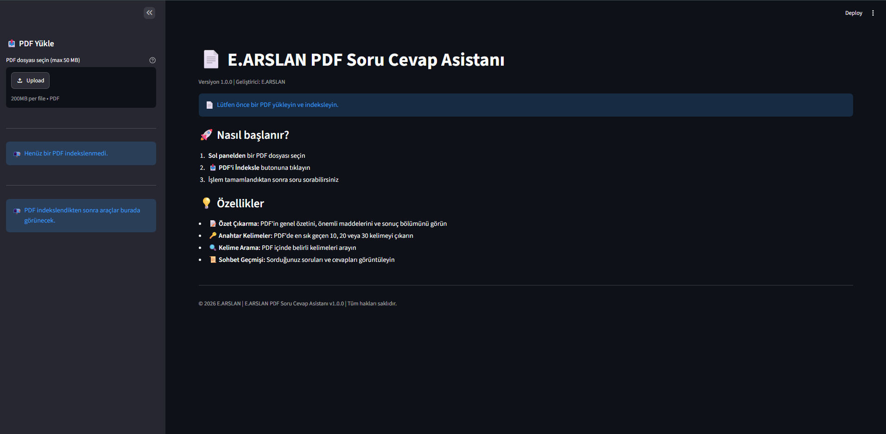
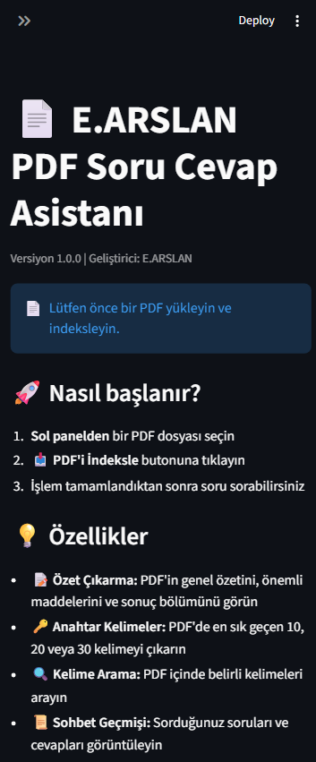

\# E.ARSLAN PDF Soru-Cevap Asistanı


> PDF belgelerinizi yükleyin, belge içeriği üzerinden doğal dil ile sorular sorun ve yapay zekâ destekli yanıtlar alın.


\*\*E.ARSLAN PDF Soru-Cevap Asistanı\*\*, PDF dokümanları üzerinden soru-cevap işlemleri gerçekleştirmek için geliştirilmiş yapay zekâ destekli bir masaüstü/web uygulamasıdır.


Uygulama sayesinde uzun PDF belgelerini manuel olarak incelemek yerine belgeyi sisteme yükleyebilir ve doküman içerisindeki bilgiler hakkında doğrudan sorular sorabilirsiniz.


\---


\## 📸 Uygulama Görünümleri


\### 🖥️ Masaüstü Görünümü


<div align="center">

&#x20; 

</div>


\### 📱 Mobil Görünüm


<div align="center">

&#x20; 

</div>


\---


\## 🚀 Özellikler


\* 📄 PDF belge yükleme

\* 🤖 Yapay zekâ destekli soru-cevap

\* 💬 Doğal dil ile soru sorabilme

\* 🔎 PDF içeriğinden bilgi sorgulama

\* 📚 Uzun dokümanlarla çalışma

\* ⚡ Hızlı ve kullanıcı dostu arayüz

\* 🖥️ Masaüstü uyumlu tasarım

\* 📱 Mobil uyumlu responsive tasarım

\* 🧠 Belge içeriğine dayalı yanıt üretimi

\* 📝 PDF içerisindeki bilgileri daha kolay analiz edebilme

\* 📊 Kullanıcı dostu doküman inceleme deneyimi


\---


\## 🎯 Kullanım Amacı


E.ARSLAN PDF Soru-Cevap Asistanı'nın temel amacı, PDF belgelerinde bilgi arama ve belge analizi süreçlerini kolaylaştırmaktır.


Özellikle;


\* Ders notları

\* Eğitim dokümanları

\* Teknik dokümanlar

\* Kullanım kılavuzları

\* Raporlar

\* Araştırma dokümanları

\* Uzun PDF belgeleri


gibi içeriklerde belirli bilgilerin daha hızlı bulunmasına yardımcı olur.


Kullanıcı PDF dosyasını yükledikten sonra belge içerisindeki bilgiler hakkında doğal bir şekilde soru sorabilir.


Örneğin:


```text

Bu dokümanın temel amacı nedir?

```


```text

Dokümanda belirtilen önemli tarihler nelerdir?

```


```text

Bu bölümde hangi konular anlatılıyor?

```


```text

Belgede belirtilen ana maddeleri özetler misin?

```


\---


\# 🛠️ Kullanılan Teknolojiler


Projenin temel çalışma altyapısında aşağıdaki teknolojiler kullanılmaktadır:


\* \*\*Python 3.12+\*\*

\* \*\*Streamlit\*\*

\* \*\*PDF işleme teknolojileri\*\*

\* \*\*Yapay zekâ / LLM tabanlı soru-cevap\*\*

\* \*\*HTML / CSS\*\*

\* \*\*Batch Script\*\*

\* \*\*Yerel web uygulaması mimarisi\*\*


> Kullanılan yapay zekâ modeli ve yardımcı Python kütüphaneleri projenin yapılandırmasına bağlı olarak değişebilir.


\---


\# ⚙️ Kurulum


Kurulum işlemi yalnızca \*\*ilk kullanımda bir kez\*\* yapılmalıdır.


\## 1. `setup.bat` Dosyasını Çalıştırın


Proje klasöründe bulunan:


```text

setup.bat

```


dosyasına çift tıklayın.


Kurulum işlemi otomatik olarak başlayacaktır.


\## 2. Kurulumun Tamamlanmasını Bekleyin


Kurulum işlemi bilgisayarınızın performansına ve internet bağlantınızın hızına bağlı olarak yaklaşık \*\*5-10 dakika\*\* sürebilir.


Kurulum sırasında gerekli Python paketleri ve uygulama bileşenleri yüklenir.


> \*\*Önemli:\*\* İlk kurulum sırasında internet bağlantısı gereklidir.


\## 3. Kurulum Tamamlandıktan Sonra


Kurulum tamamlandıktan sonra uygulamayı kullanmak için `setup.bat` dosyasını tekrar çalıştırmanıza gerek yoktur.


Uygulamayı doğrudan `start.bat` üzerinden başlatabilirsiniz.


\---


\# ▶️ Uygulamayı Çalıştırma


Uygulamayı her kullanmak istediğinizde aşağıdaki adımları uygulayın.


\## 1. `start.bat` Dosyasını Çalıştırın


Proje klasöründe bulunan:


```text

start.bat

```


dosyasına çift tıklayın.


\## 2. Tarayıcıyı Açın


Uygulama başlatıldıktan sonra tarayıcınızda aşağıdaki adresi açın:


```text

http://localhost:8501

```


\## 3. PDF Dosyanızı Yükleyin


Uygulama arayüzünden analiz etmek istediğiniz PDF dosyasını yükleyin.


\## 4. Sorunuzu Sorun


PDF içerisindeki bilgiler hakkında doğal dil kullanarak sorularınızı yazabilirsiniz.


Uygulama, yüklenen PDF içerisindeki bilgilere göre yanıt üretir.


\---


\# 💻 Sistem Gereksinimleri


| Gereksinim      | Değer                            |

| --------------- | -------------------------------- |

| İşletim Sistemi | Windows 10 / Windows 11          |

| Python          | 3.12 veya üzeri                  |

| RAM             | 8 GB önerilir                    |

| Disk Alanı      | En az 2 GB boş alan              |

| İnternet        | İlk kurulum için gerekli         |

| Tarayıcı        | Güncel Chrome, Edge veya Firefox |


> Yapay zekâ modeli ve kullanılan kütüphanelere bağlı olarak RAM ve disk kullanımı değişiklik gösterebilir.


\---


\# 📁 Proje Yapısı


Temel proje yapısı aşağıdaki şekildedir:


```text

E.ARSLAN-PDF-Soru-Cevap-Asistani/

│

├── setup.bat

├── start.bat

│

├── logs/

│   └── app.log

│

├── Masaüstü-Görünüm.png

├── Mobil-görünüm.png

│

└── ...

```


\## Önemli Dosyalar


| Dosya / Klasör         | Açıklama                                    |

| ---------------------- | ------------------------------------------- |

| `setup.bat`            | İlk kurulum işlemini başlatır               |

| `start.bat`            | Uygulamayı çalıştırır                       |

| `logs/app.log`         | Uygulama çalışma ve hata kayıtlarını içerir |

| `Masaüstü-Görünüm.png` | Masaüstü arayüz ekran görüntüsü             |

| `Mobil-görünüm.png`    | Mobil arayüz ekran görüntüsü                |


\---


\# 🔧 Sorun Giderme


Uygulama çalışmıyorsa aşağıdaki kontrolleri gerçekleştirin.


\## 1. Log Dosyasını Kontrol Edin


Uygulama tarafından oluşturulan hata ve çalışma kayıtlarını:


```text

logs/app.log

```


dosyasından kontrol edin.


\## 2. Kurulumu Tekrar Çalıştırın


Gerekli bağımlılıkların eksik olması durumunda:


```text

setup.bat

```


dosyasını tekrar çalıştırabilirsiniz.


\## 3. Python Sürümünü Kontrol Edin


Komut İstemi'ni açın ve:


```bash

python --version

```


komutunu çalıştırın.


Python sürümünüzün \*\*3.12 veya üzeri\*\* olduğundan emin olun.


\## 4. Uygulama Adresini Kontrol Edin


Uygulama çalıştıktan sonra:


```text

http://localhost:8501

```


adresinin tarayıcıda açıldığından emin olun.


\---


\# 🔐 Güvenlik ve Gizlilik


PDF belgeleri kişisel, ticari veya başka hassas bilgiler içerebilir.


Bu nedenle:


\* Yalnızca güvenilir PDF dosyaları kullanın.

\* Hassas belgeleri kullanmadan önce uygulamanın veri işleme yöntemini kontrol edin.

\* API anahtarlarını kaynak koduna doğrudan eklemeyin.

\* Gizli yapılandırma bilgilerini güvenli yapılandırma mekanizmalarında saklayın.

\* Log dosyalarında PDF içeriği veya hassas kullanıcı bilgilerinin gereksiz şekilde tutulmasını engelleyin.

\* Uygulamayı internete açık şekilde yayınlamadan önce erişim kontrolü ve güvenlik yapılandırmalarını değerlendirin.


> `localhost` üzerinde çalışan bir uygulama ile internete açık bir sunucuda çalışan uygulamanın güvenlik gereksinimleri aynı değildir.


\---


\# 🧪 Test Senaryoları


Uygulamanın güvenilir şekilde çalıştığını doğrulamak için aşağıdaki senaryolar test edilmelidir:


\### PDF İşleme


\* \[x] Geçerli PDF yükleme

\* \[ ] Boş PDF yükleme

\* \[ ] Bozuk PDF yükleme

\* \[ ] Çok büyük PDF yükleme

\* \[ ] Türkçe karakter içeren PDF yükleme

\* \[ ] Görsel ağırlıklı PDF yükleme


\### Soru-Cevap


\* \[ ] PDF içerisindeki mevcut bilgi hakkında soru sorma

\* \[ ] PDF içerisinde bulunmayan bilgi hakkında soru sorma

\* \[ ] Uzun soru gönderme

\* \[ ] Birden fazla soru gönderme

\* \[ ] Türkçe karakter içeren soru gönderme

\* \[ ] PDF yüklemeden soru sorma


\### Sistem


\* \[ ] İnternet bağlantısı kesildiğinde davranış

\* \[ ] Eksik Python bağımlılıkları

\* \[ ] `start.bat` çalıştırma

\* \[ ] `setup.bat` tekrar çalıştırma

\* \[ ] Log dosyasının oluşturulması

\* \[ ] Uygulamanın yeniden başlatılması


\---


\# 🔄 Kullanım Akışı


```text

┌─────────────────┐

│    setup.bat    │

└────────┬────────┘

&#x20;        │

&#x20;        ▼

┌─────────────────┐

│   İlk Kurulum   │

└────────┬────────┘

&#x20;        │

&#x20;        ▼

┌─────────────────┐

│    start.bat    │

└────────┬────────┘

&#x20;        │

&#x20;        ▼

┌─────────────────────────┐

│ http://localhost:8501   │

└────────────┬────────────┘

&#x20;            │

&#x20;            ▼

┌─────────────────┐

│    PDF Yükle    │

└────────┬────────┘

&#x20;        │

&#x20;        ▼

┌─────────────────┐

│   Soru Sor      │

└────────┬────────┘

&#x20;        │

&#x20;        ▼

┌─────────────────┐

│  Yapay Zekâ     │

│     Yanıtı      │

└─────────────────┘

```


\---


\# 📌 Sürüm Bilgisi


\## v1.0.0


İlk kararlı sürüm.


\### Özellikler


\* PDF dosyası yükleme

\* PDF içeriği üzerinden soru-cevap

\* Yapay zekâ destekli yanıt oluşturma

\* Responsive kullanıcı arayüzü

\* Masaüstü uyumluluğu

\* Mobil uyumluluk

\* `setup.bat` ile otomatik kurulum

\* `start.bat` ile uygulama başlatma

\* Loglama altyapısı

\* Yerel `localhost:8501` çalışma desteği


\---


\# 👨‍💻 Geliştirici


\## E.ARSLAN


Yazılım geliştirme, yapay zekâ ve uygulama çözümleri.


\---


\# 📜 Lisans


\*\*Copyright © 2026 E.ARSLAN\*\*


\*\*Tüm hakları saklıdır.\*\*


Bu proje, geliştiricinin izni olmadan ticari amaçlarla kopyalanamaz, yeniden dağıtılamaz veya değiştirilerek başka bir ürün olarak sunulamaz.


\---


<div align="center">


\### E.ARSLAN PDF Soru-Cevap Asistanı


\*\*PDF belgelerinizle daha hızlı ve pratik çalışın.\*\*


</div>


